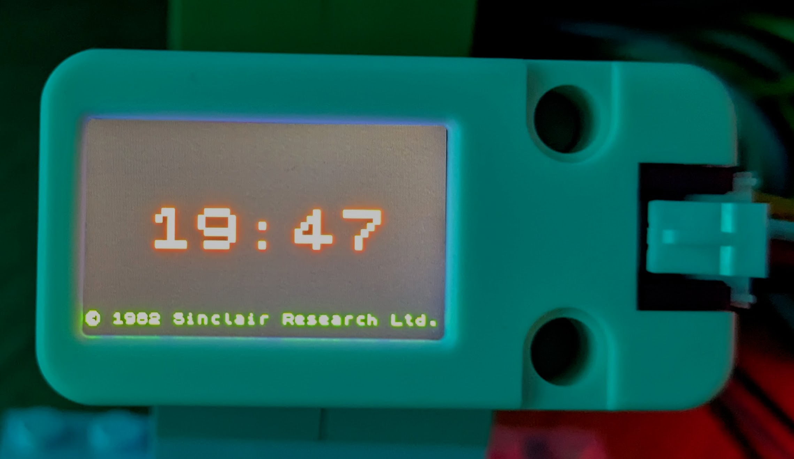

# Making the ST7789v2 work

_Over [i2c](https://learn.sparkfun.com/tutorials/i2c/all) on an [ESP32](https://www.espressif.com/en/products/socs/esp32)_

I bought [one of these little colour LCD screens](https://docs.m5stack.com/en/unit/lcd) kind of on a whim (just after we got back from [EMF](https://sam.pikesley.org/blog/2024/06/11/the-best-weekend-you-can-have/)), assuming it would do something useful out-of-the-box, but I couldn't make it do anything at all, so I chucked in a drawer and forgot about it.

However I recently had cause to start fiddling with [ESPHome](https://esphome.io/index.html), which meant I had a couple of ESP32s knocking around, so I pulled out the screen to see if I could get it working over the Christmas break.

And of course I couldn't. I [reached out to the nerds of Mastodon](https://mastodon.me.uk/deck/@pikesley/113686799879809840), got lots of great feedback, and now here we are.

## Connecting it up

I used an [ESP32 C3 Super Mini](https://www.espboards.dev/esp32/esp32-c3-super-mini/) for this - I guess it will work on other ESP32s too, but you might need to change some of the pins. So:

The screen has four wires, which I connected like:

| screen | esp32 |
| ------ | ----- |
| 5v     | 5v    |
| GND    | GND   |
| SCL    | Pin 8 |
| SDA    | Pin 9 |

## Running the demo

The following presumes that your device [already has the micropython firmware on it](https://micropython.org/download/ESP32_GENERIC_C3/), and that you can run [`mpremote`](https://docs.micropython.org/en/latest/reference/mpremote.html).

I've tested this only on my Mac, but I presume it'll mostly work elsewhere:

### Get the code


### Configure your wifi secrets

You need a file in the root of the repo called `secrets.py` that looks like this:

```python
SSID = "my-home-wifi"
KEY = "mysupersecretwifipassword"
```

### Push the code

Connect your esp32 to your computer via USB, then run:

```bash
make push connect
```

This will (probably) copy the code across, then wait. If you hit `ctrl-D`, it will reboot, connect to your wifi, sync its time with an NTP server and start showing a clock:



[`mpremote`](https://github.com/espressif/esptool) seems to be quite good at detecting connected devices and selecting the correct USB device, but if it doesn't work for you, you might need to amend the `make` target with a `device` argument or something

```make
push:
	python -m mpremote cp -r *py :
	python -m mpremote cp -r *json :

connect:
	python -m mpremote
```

## The code

You can run the tests on the Docker container:

```bash
make build
make run
```

and then

```bash
```
