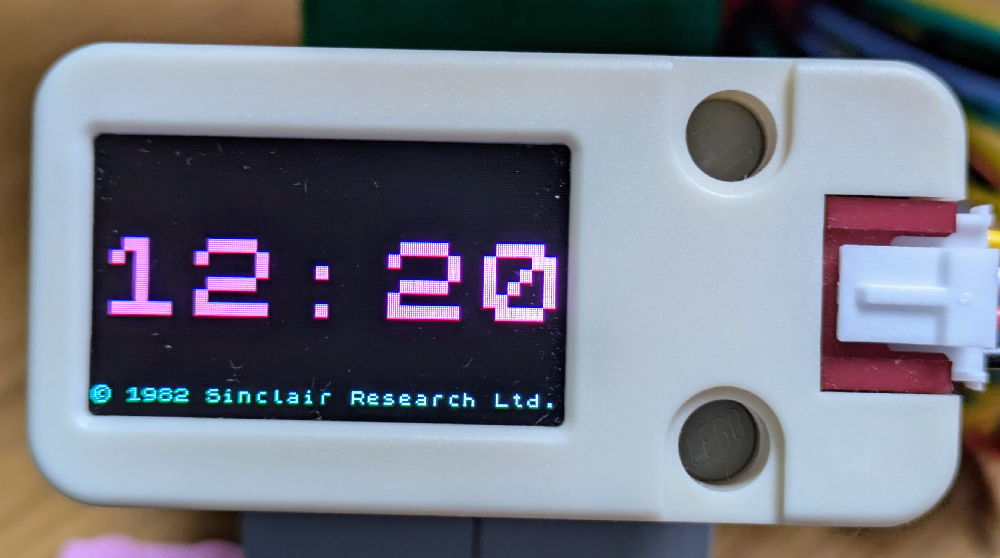

# Making the ST7789v2 work

_Over [i2c](https://learn.sparkfun.com/tutorials/i2c/all) on an [ESP32](https://www.espressif.com/en/products/socs/esp32)_

I bought [one of these little colour LCD screens](https://docs.m5stack.com/en/unit/lcd) kind of on a whim (just after we got back from [EMF](https://sam.pikesley.org/blog/2024/06/11/the-best-weekend-you-can-have/)), assuming it would do something useful out-of-the-box, but I couldn't make it do anything at all, so I chucked in a drawer and forgot about it.

However I recently had cause to start fiddling with [ESPHome](https://esphome.io/index.html), which meant I had a couple of ESP32s knocking around, so I pulled out the screen to see if I could get it working over the Christmas break.

And of course I couldn't. I [reached out to the nerds of Mastodon](https://mastodon.me.uk/deck/@pikesley/113686799879809840), got lots of great feedback, and now here we are.

## Connecting it up

I used an [ESP32 C3 Super Mini](https://www.espboards.dev/esp32/esp32-c3-super-mini/) for this - I guess it will work on other ESP32s too, but you might need to change the data pins.

The screen has four wires, which I connected like:

| screen | esp32 |
| ------ | ----- |
| 5v     | 5v    |
| GND    | GND   |
| SCL    | Pin 8 |
| SDA    | Pin 9 |

## Running the demo

The following presumes that your device [already has the micropython firmware on it](https://micropython.org/download/ESP32_GENERIC_C3/), and that you can run [`mpremote`](https://docs.micropython.org/en/latest/reference/mpremote.html).

I've tested this only on my Mac, but I presume it'll mostly work elsewhere:

### Get the code

```bash
git clone https://github.com/pikesley/st7789v2-micropython.git
cd st7789v2-micropython
```


### Configure your wifi secrets

You need a file in the root of the repo called `secrets.py` that looks like this:

```python
SSID = "my-home-wifi"
KEY = "mysupersecretwifipassword"
```

### Push the code

Connect your esp32 to your computer via USB, then run:

```bash
make push connect
```

This will (probably) copy the code across, then wait. If you hit `ctrl-D`, it will reboot, connect to your wifi, sync its time over NTP and start showing a clock:



[`mpremote`](https://github.com/espressif/esptool) seems to be quite good at detecting connected devices and selecting the correct USB device, but if it doesn't work for you, you might need to amend the `make` target with a `device` argument or something

```make
push:
	python -m mpremote cp -r *py :
	python -m mpremote cp -r *json :

connect:
	python -m mpremote
```

## The code

There are a load of tests, which can run on the Docker container:

```bash
make build
make run
```

and then

```bash
```

If the code has a slightly "bashed together over the Christmas holidays without much organisation" feel to it, that's because that's exactly what happened.

## How does it work?

I had been using one of [these little OLED screens](https://www.adafruit.com/product/3527) on a [Raspberry Pi project](https://sam.pikesley.org/projects/glowing-hat/), where I was [assembling images](https://github.com/hat-festival/glowing-hat/blob/main/glowing_hat/oled.py#L75-L92) with [Pillow](https://pillow.readthedocs.io/en/stable/) and then [throwing them at the screen](https://github.com/hat-festival/glowing-hat/blob/main/glowing_hat/oled.py#L40). In a characteristic display of breathtaking naievety, I had assumed I could do something similar with this new screen. My optimism was wildly misplaced.

### Let's talk about i<sup>2</sup>c

The screen (at least in the [m5stack package](https://m5stack.com/) I have) talks [i<sup>2</sup>c](https://learn.sparkfun.com/tutorials/i2c/all). This is some low-level serial thing, which means we need to [send raw bytes to hex addresses](https://github.com/m5stack/M5Unit-LCD-Internal-FW/blob/master/en/README.md#command-list), something I have studiously avoided thinking about for many years.

Fortunately micropython has [built-in i<sup>2</sup>c support](https://docs.micropython.org/en/latest/library/machine.I2C.html), which makes it surprisingly easy to turn the screen up to full brightness by doing something like

```python
from machine import Pin, SoftI2C
i2c = SoftI2C(sda=Pin(9), scl=Pin(8), freq=400000)

i2c.writeto_mem(0x3E, 0x22, bytearray([0xff]))
```

where

* `0x3E` is the device's i<sup>2</sup>c address (findable with `i2c.scan()`)
* `0x22` is the "set brightness" command, and
* `0xff` says "set the brightness to 255"

## Drawing pictures

There are commands to draw individual pixels, rectangles, and even whole images, using 4 different colour depths (the first two of which were new to me):

* [rgb332](https://roger-random.github.io/RGB332_color_wheel_three.js/), where a whole RGB colour fits into a single byte
* [rgb565](https://rgbcolorpicker.com/565), with 2 bytes for an RGB colour
* rgb888, which is your convential 24-bit RGB triple, and
* rgb8888, which is that, but with an alpha channel

## The font

If you know me, you might know that I'm [marginally obsessed](https://sam.pikesley.org/talks/#vandalising-your-github-commit-history-emf-2014) with the [Sinclair Spectrum character set](https://sam.pikesley.org/projects/1982/), so obviously that was my choice for rendering here. The whole thing fits into [a set of lists of lists of bytes](https://github.com/pikesley/st7789v2-micropython/blob/docs/st7789v2/conf/font.json), and with [a little manipulation it's easy to scale it up](https://github.com/pikesley/st7789v2-micropython/blob/docs/st7789v2/tests/test_font_tools.py#L25-L54).

## Run-Length Encoding

The screen also supports the rendering of images compressed with [run-length encoding](https://en.wikipedia.org/wiki/Run-length_encoding), which is a surprisingly easy-to-implement lossless compression technique that I've [tackled before](https://github.com/pikesley/nineteen-eighty-two/blob/master/spec/nineteen/eighty/two/decorators/run_length_encoder_spec.rb).

## Putting it all together

So each character of our string is
* looked up in the character-set
* scaled up

Then
* the characters are joined together horizontally
* the whole thing is colourised,
* run-length encoded, and then
* the resulting bytes are made available from a [generator](https://wiki.python.org/moin/Generators)

My early bumblings didn't bother with a generator and just attempted to yeet the entire list at the rendering tools, but it's remarkably easy to make your tiny microcontroller run out of memory, so we have to do it this way.

## Using the tool

To actually write some text to the screen, you just do something like this:

```python
from st7789v2.screen import screen

screen.write_text(
	"Hello World!",
	x="centered",
	y="centered",
	colour=255,  # unsurprisingly, this is white in rgb332
	scale_factor=1,
)
```

## Packaging

I have attempted to structure this like a [micropython package](https://docs.micropython.org/en/latest/reference/packages.html#writing-publishing-packages), but the contents of [`package.json`](https://github.com/pikesley/st7789v2-micropython/blob/docs/st7789v2/package.json) are an absolute guess based on stuff I found elsewhere.

## Next steps

I want to work out how to reduce a PNG or something to just a series of bytes, run-length encode them, then display them. Thus far this has led only to a lot of swearing.
